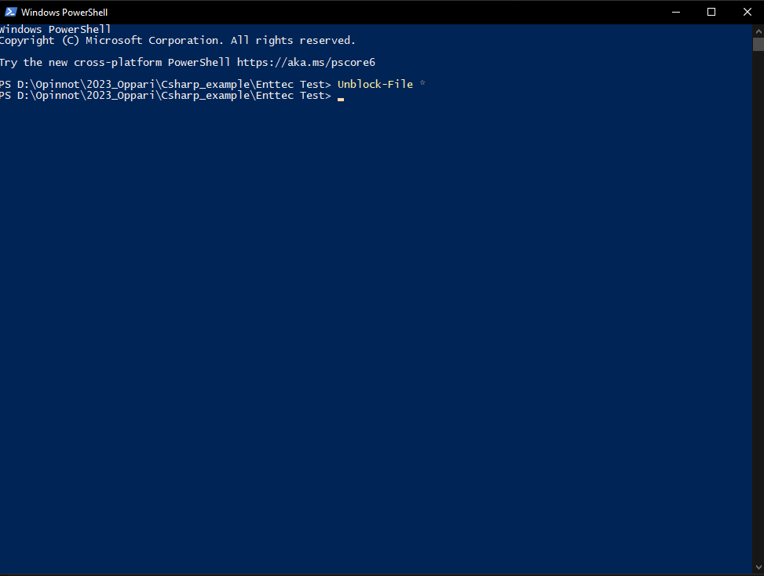

# Diary

This is what I've done every time I've worked on this.

## 10.3.2023 3h

- Started with the thesis project.
- Tested that lights and OpenDMX work.
- Started the work on git.
- Started using Pyusb, and how I could do this.
- Found couple of direct USB to DMX gits, but I don't want to use them. I want to learn them by myself.
- Foundout what the VendorID and ProductID is for OpenDMX (find_usb dir).
- Did Readme and TODO list.
- Used couple of tutorials to get it working: [Pyusb tutorial](https://github.com/pyusb/pyusb/blob/master/docs/tutorial.rst)..
- OpenDMX doesn't have drivers, so have to install Zadig to install WinUSB [How to use Libusb on Windows](https://github.com/libusb/libusb/wiki/Windows#How_to_use_libusb_on_Windows).
  - libusb is the backend for pyusb.

## 06.06.2023 3 h
- Worked on connecting the lamp to the software
- Piti ladata WinUSB koska kuulemma pyusb ei toimi suoraan Windowsilla
- https://stackoverflow.com/questions/31960314/pyusb-1-0-notimplementederror-operation-not-supported-or-unimplemented-on-this
- https://github.com/libusb/libusb/wiki/Windows#How_to_use_libusb_on_Windows
- https://zadig.akeo.ie/
- Open Enttex had it's own driver, but i had to swap it to another one with Zadig.

## 07.06.2023 21.15 - 22.03 (0h 48 min)
- Worked on the env
- Made the virtualenv, requirements.txt etc


## 08.06.2023 19.40 - 22.17 (2 h 37 min)
- Worked on git
  - Cloned my thesis git to github.
- Tried to get the communication working
- Managed to untangle the driver fiasco. Turns out I didn't need the Win or lib drivers
- I had to find the port, which required uninstalling third party drivers.
- I can now again control the light from the lighting software
- I cannot get it working from the code. Frustrating
- Added a git alias:
```
git config --global alias.yolo '!sh -c "git commit -am \"`curl -sL https://whatthecommit.com/index.txt`\""'

```


## 08.06.2023 22.30 - 22.45 (15 min)

## 11.06.2023 17.45 - 18.46 (1 h 1 min)

## 04.08.2023 18.00 - 22.00 (4 h)
- Vaihdoin kohdetta, että en tänään katsonut usb asioita, vaan katsoin pystynkö vaihtamaan screenillä väriä kun soitan musiikkia.
- Sain tämän onnistumaan
- Made something???


## 05.08.2023 14.00 - 17.00 (3 h)
- Huomasin, miten eilisessä se otti mikin eikä suoraan outputtia, niin latasin vb-audion joka otaa sound outputin, ja laittaa sen inputiksi.
- Yritän nyt selvittää miten voin tehdä että se menee outputtiin ja inputtiin, koska muuten en kuule musiikkia.
- En usko että riittää pelkkä virtuaalinen kaapeli, mä tartten luultavasti virtuaaliseta mikseriä, joka osottaa outputin kumpaankin.
- Lataan Virtual Audio Mixerin VOICEMEETER
- Tämä toimi
- Sain toimimaan, sain eri värejä myöskin näkymään.
- Kokeilin myös laskea miten eri frequency toimivat, ja en tee enää intensiteetillä vaan freq_countilla
  
## 05.08.2023 19.30 - 23.30 (4 h)
- Continued on test/test8/test3.py
- Tried to count more, it just counts couple
- Mä saan koodin helposti reagoimaan ääneen, mutta sen jakamisessa eri taajuuksiin on vaikeaa. Nyt se näyttää vaan jollain tasolla intensiivityyden
- tutkin erilaisia frequency analyzereita, ja en saanut vielä toimimaan. Mutta nämä luultavasti auttavat löytämään ratkaisun.

## 29.01.2024 14.30 - 18.30 
- Yritän tutkia missä olin tutkimusten kanssa, koska en muista mitä olin tekemässä.
- Paljon ongelmia sen kanssa, että OpenDMX laitteita ei voi kontrolloida normaaleilla serial kirjastoilla, esimerkiksi PySerial. Varsinkin kun monia kirjastoja löytyy mitkä toimii Pro version kanssa.
- Mun pitää tehdä WinUSB Driveri jotta saan edes kokeiltua toimiiko tämä.

## 31.01.2024 1.20 - 2.30 ; 1 h 10 min
- Started looking into another library that should work with OpenDMX. I managed to make the pipeline work inside PyOpenDmxUsb... At least I got some results inside the c# DMXServer, though I haven't gotten anything on the lamp yet.

## 31.01.2024 11.00 - 12.00 ; 1 h 0 min
- Success!!! I managed to get the Enttec OpenDMX C# Example working!!!!!! Now I just need to reverse engineer how to do that in my file.
  - I ran the Enttec OpenDMX C# Example [You can get it from here](https://www.enttec.co.uk/en/product/dmx-usb-interfaces/open-dmx-usb/) on Visual Studio. Before it started working I had to unblock the files, since they came from the internet, so I ran the Powershell cmd `Unblock-File *` in the correct directory.
  - 

## 31.01.2024 13.20 - 15.25 ; 2 h 5 min
- Yritän saada C# koodia toimimaan.
- Sain C# esimerkin toimimaan

## 04.02.2024 16.30 - 18.00 ; 1 h 30 min
- Yritän saada PyOpenDMX Usb koodin toimimaan C# esimerkin avulla.
- En saanut sitä, mutta sain Csharp_examplessa olevan C# koodin toimimaan.

## 04.02.2024 20.00 - 21.10 ; 1 h 10 min
- Made a fresh ConsoleApp working (DMX_Server in the main dir)

## 06.02.2024 17.40 - 19.10 ; 1 h 30 min
- Yritän  importata efektejä main.pyhyn 

## 13.02.2024 17.30 - 20.40 ; 3 h 10 min
- En tiedä mitä yritän, tehdä erilaisia efektejä kai.
- Sain tehtyä paljon. Sain kummatkin pipelinen puolet kokeilemaan uudestaan, jos connection rikkoontuu. Sen lisäksi sain tehtyä muutamia efektejä, esimerkiksi rotating one ja kaikki valot päälle. Jostain syystä minun tarvitsee laittaa kaksi kertaa dataa pipelineen jotta se lukee kaiken.

## 27.02.2024 17.30 - 20.00 ; 2 h 30 min
- An effect made, rotate and RGB backward and forward
- Started to analyse audio

## 04.03.2024 21.15 - 23.45 ; 2 h 30 min
- Audio analysis
- Made it possible to analyze audio, to stream audio, to analyze it in blocks, and managed to do the supposed effect I want to do in matplotlib window.

## 06.03.2024 19.20 - 22.00 ; 2 h 40 min
- Made audio analysis tools and functions, and made the first try on the visual equalizer.

## 08.03.2024 18.00 - 22:30 ; 2 h 30 min
- Made the loudness db based, made a range of db values that affect it, and made some tweaks all around.
- A "finished" visual equalizer, next project is the GUI

## 09.03.2024 12.30 - 16:30 ; 4 h 00 min
- Tkinter app finished.